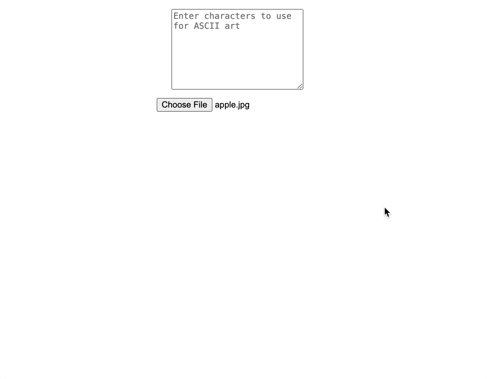

# ⚡ Code + Art

Creative coding projects by [Yuichi Yogo](https://github.com/yuichkun).

<!-- toc -->

- [Audio](#audio)
  * [Cycling '74 Max](#cycling-74-max)
    + [Single Motion Granular](#single-motion-granular)
    + [n4m Feature Extractor](#n4m-feature-extractor)
    + [PoseNet for Max](#posenet-for-max)
  * [Chromesthizer](#chromesthizer)
  * [Web Audio Pitch Dropper](#web-audio-pitch-dropper)
  * [Building Audio Apps with JavaScript](#building-audio-apps-with-javascript)
  * [Plugins](#plugins)
    + [Interval Explorer](#interval-explorer)
- [Visuals](#visuals)
  * [People](#people)
  * [Kokuyo Design Award 2022 Virtual Trophy](#kokuyo-design-award-2022-virtual-trophy)
  * [Layered Pixelation](#layered-pixelation)
  * [Image Tessellation](#image-tessellation)
  * [Text-Masked Video](#text-masked-video)
  * [Animated URL Bar](#animated-url-bar)
  * [ASCII Art Generator](#ascii-art-generator)

<!-- tocstop -->

## Audio

### Cycling '74 Max

#### Single Motion Granular

[🔗 Demo](https://kentaro-granular-web.vercel.app/) • [📝 Learn more](https://github.com/yuichkun/kentaro-granular-web/blob/master/README.md)

A granular synthesis experiment with an intuitive XY pad interface. Transform audio samples into rich, evolving textures through fluid motion control. Built with RNBO, featuring DSP by [kentaro tools](https://kentaro.tools/).

#### n4m Feature Extractor

[📝 Learn more](https://github.com/yuichkun/n4m-feature-extractor)

A Max/MSP-based real-time neural network training interface. Create custom image classification models by feeding webcam streams through ml5.js. Built for Max 8.0.0+, enabling interactive machine learning experimentation.

#### PoseNet for Max

[📝 Learn more](https://github.com/yuichkun/n4m-posenet)

A Max/MSP integration of TensorFlow.js PoseNet model via Electron. Enables real-time body tracking and pose estimation directly within Max patches. Features configurable detection parameters and outputs skeletal data as Max-friendly dictionaries.

### Chromesthizer

[🔗 Demo](https://chromesthizer.vercel.app/) • [📝 Learn more](https://github.com/yuichkun/chromesthizer/blob/master/README.md)

An audio-visual experiment that transforms images into sound using Web Audio API. Upload images and hear their sonic representation with real-time filter controls.

### Web Audio Pitch Dropper

[🔗 Demo](https://web-audio-pitch-dropper.vercel.app/) • [📝 Learn more](https://github.com/yuichkun/web-audio-pitch-dropper)

A vinyl turntable simulator enabling real-time audio playback speed manipulation through Web Audio API's AudioWorklet. Features variable-speed playback from -2x to 2x with reverse capability, and a distinctive pitch-drop effect with smooth 3-second cubic ease-out deceleration. Built with Vue and TypeScript, featuring drag-and-drop audio upload, sample-accurate interpolation, and an animated record visualization synchronized to playback speed.

### Building Audio Apps with JavaScript

[🔗 Demo](https://building-audio-apps-with-js.vercel.app/) • [📝 Learn more](https://github.com/yuichkun/building-audio-apps-with-js)

An interactive presentation exploring professional audio application development in JavaScript. Covers Web Audio API graph-based architecture, AudioWorklet's high-priority processing thread, and WebAssembly integration via JUCE and RNBO. Features live demonstrations of custom reverb implementations, convolution reverb, and experimental WebGPU-accelerated audio processing. Built with Slidev, supporting English, Japanese, and Chinese.

### Plugins

#### Interval Explorer

[📝 Learn more](https://github.com/yuichkun/interval-explorer)

A Max for Live MIDI device for exploring musical interval combinations and chord voicings. Features combinatorial interval generation and real-time MIDI processing for experimental composition.

## Visuals

### People

[🎥 Video](https://www.youtube.com/watch?v=v-NETHnK0Mo) • [📝 Learn more](https://github.com/yuichkun/people)

An interactive art installation exploring communication and artificial consciousness through networked string telephones with embedded AI. Each ESP32-powered cup displays text on OLED screens and plays audio, while modifying word vectors to reinterpret messages as they pass through the chain—creating a technological game of telephone that questions the nature of communication and personhood.

### Kokuyo Design Award 2022 Virtual Trophy

[🔗 Demo](https://www.kokuyo.co.jp/trophy2022/) • [📝 Learn more](https://yogo-management-office.com/works/kokuyo-design-award-2022)

A [Next.js](https://nextjs.org/)-based 3D trophy viewer that displays time-evolving models using [model-viewer](https://modelviewer.dev/). Features daily model transitions with extensive [Playwright](https://playwright.dev/) testing to ensure consistent rendering across 366 days.

### Layered Pixelation

[🔗 Demo](https://layered-pixelation.vercel.app/) • [📝 Learn more](./prototypes/layered-pixelation/README.md)

Interactive WebGL experiment with dynamic pixelation effects and mouse-based distortion.

### Image Tessellation

[📝 Learn more](https://github.com/yuichkun/mosaic-by-image-gathering/blob/master/README.md)

A [Processing](https://processing.org/)-based mosaic art generator that reconstructs images using collections of thematically related photos. Features real-time image analysis and dynamic grid adjustments.

### Text-Masked Video

[🔗 Demo](https://css-mask-video-with-text.vercel.app/) • [📝 Learn more](https://github.com/yuichkun/css-mask-video-with-text)

A web experiment that uses SVG masking to reveal video through text. The text "Not Found?" gradually appears character by character, creating a mask that reveals the video underneath. Built with SVG masks and vanilla JavaScript for text animation.

### Animated URL Bar

[📝 Learn more](https://github.com/yuichkun/animated-url-bar)

An experimental browser interface that turns the URL bar into an animation canvas. Uses `window.history.pushState()` to create flowing animations with emojis and text, demonstrating unconventional uses of browser APIs. Features multiple animation effects including character code manipulation and wave-like patterns running at 7 FPS.

### ASCII Art Generator

[🔗 Demo](https://codepen.io/yuichkun/pen/yLGGrOv)

A web-based image to ASCII art converter using Canvas API. Features intelligent character density analysis - each character in the custom character set is rendered to canvas to calculate its visual weight, creating more accurate brightness mapping. Maintains image aspect ratio through different horizontal and vertical sampling rates (5px × 10px), with real-time preview on character set changes.

---
*This documentation was generated by an LLM*
